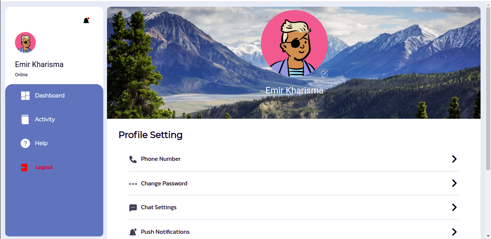
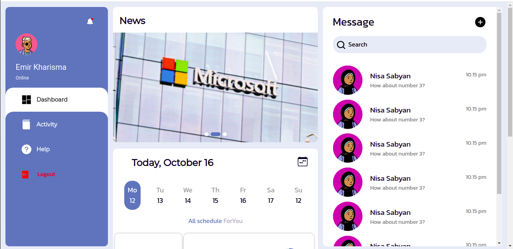
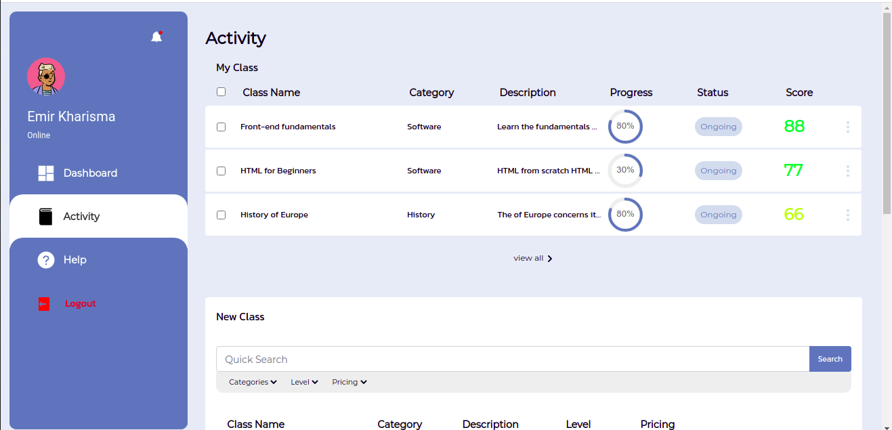
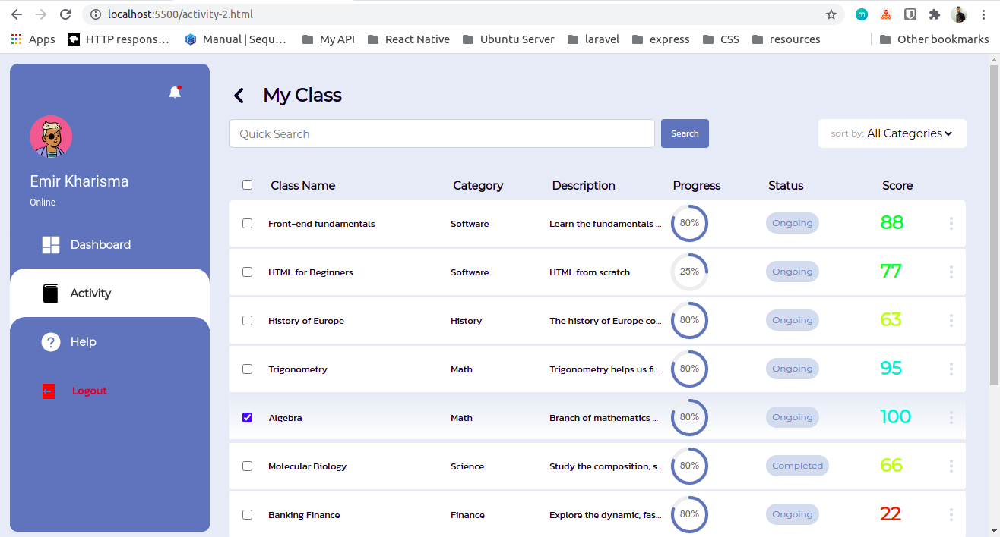

# Belajarsip

## Contents

- [Description](#description)
- [Features](#features)
- [Requirements](#requirements)
- [Installation](#installation)
- [Screenshots](#screenshots)

## Description

**Belajarsip** is a platform to bring together instructors with students or knowledge seekers. Instructors can create classes and a schedule for delivery of materials. Meanwhile, student can find the class that suits what he wants.

## Features

### Instructor

- Add and update Class
- View Student List
- Give score to student
- and many more...

### Student

- Register to class
- View learning progress
- Get score and evaluation
- Group discussion
- and many more...

## Requirements

- `HTML 5`
- `CSS 3`
- [`Bootstrap 5`](https://getbootstrap.com/docs/5.0/getting-started/introduction/)

## Installation

1. Open your terminal or command prompt
2. Clone the project

```bash
git clone https://github.com/sipamungkas/belajarsip-bootstrap5-template.git
```

## Screenshots

#### Profile page



#### Dashboard page



#### Activity page



#### Activity My Class page


